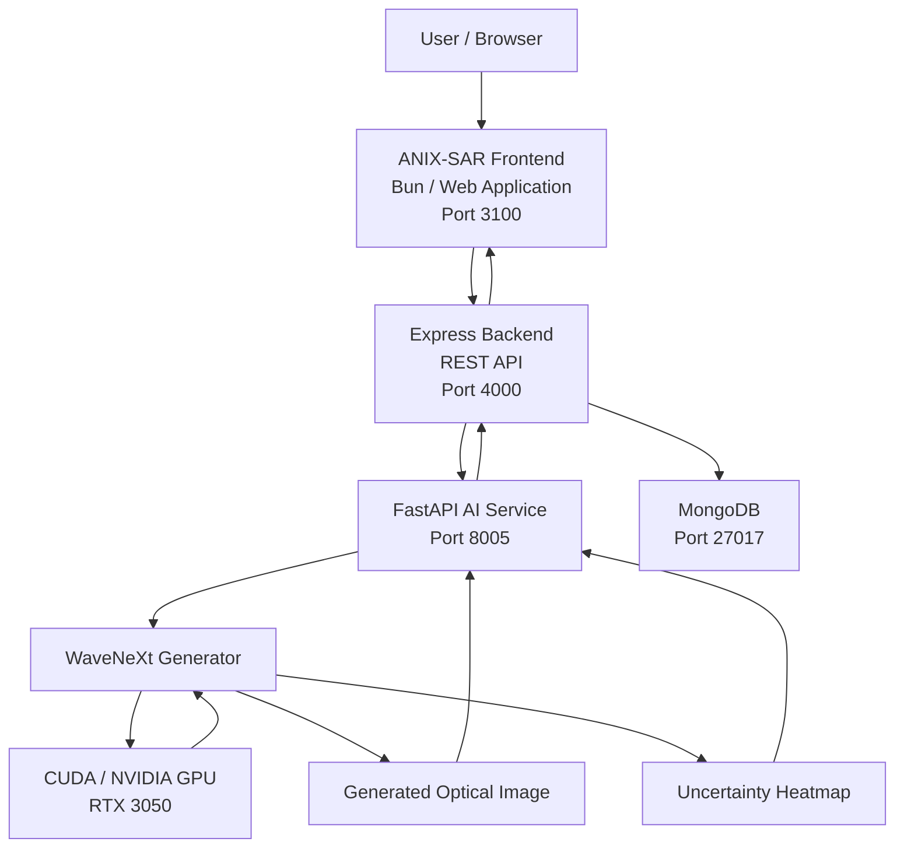
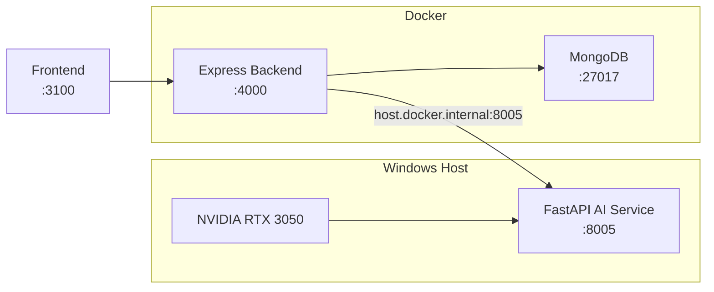
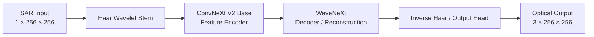
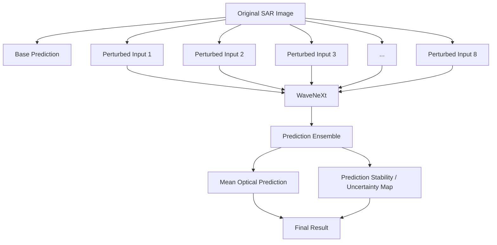
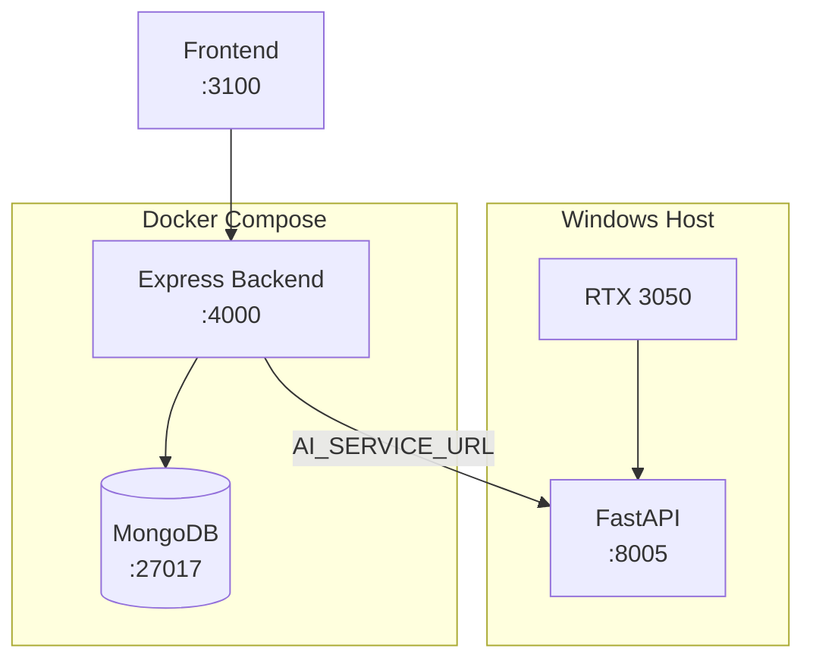
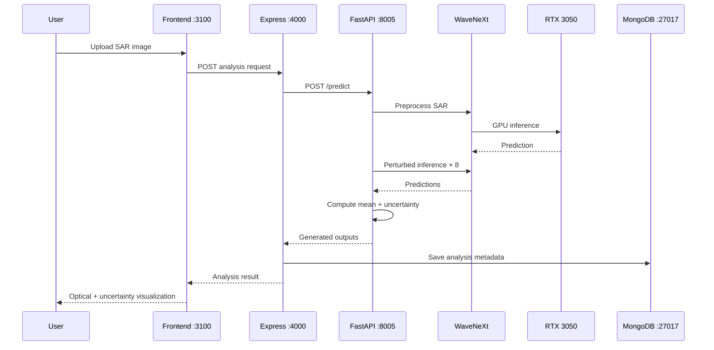

# hackindia-ai-web3-builders-hackathon-2026-anix
Hackathon team repository for ANIX - [hackindia-team:hackindia-ai-web3-builders-hackathon-2026:anix]


# ANIX-SAR — AI-Powered SAR-to-Optical Image Translation

> **ANIX-SAR** is an end-to-end AI web application that transforms Synthetic Aperture Radar (SAR) imagery into optical-like imagery using a pretrained and QXSLAB-fine-tuned **WaveNeXt** deep learning generator, with prediction-stability uncertainty estimation and a production-style web application architecture.

---

## Table of Contents

* [Overview](#overview)
* [Key Features](#key-features)
* [Problem Statement](#problem-statement)
* [How ANIX-SAR Works](#how-anix-sar-works)
* [System Architecture](#system-architecture)
* [AI Architecture](#ai-architecture)
* [Model Details](#model-details)
* [Dataset](#dataset)
* [Training Configuration](#training-configuration)
* [Uncertainty Estimation](#uncertainty-estimation)
* [Repository Structure](#repository-structure)
* [Technology Stack](#technology-stack)
* [Requirements](#requirements)
* [Installation](#installation)
* [Model Setup](#model-setup)
* [Running the AI Service](#running-the-ai-service)
* [Running the Backend](#running-the-backend)
* [Running the Frontend](#running-the-frontend)
* [Docker Setup](#docker-setup)
* [Environment Configuration](#environment-configuration)
* [Ports](#ports)
* [API Reference](#api-reference)
* [End-to-End Demo](#end-to-end-demo)
* [Inference Pipeline](#inference-pipeline)
* [Output Interpretation](#output-interpretation)
* [Troubleshooting](#troubleshooting)
* [Performance](#performance)
* [Limitations](#limitations)
* [Security Notes](#security-notes)
* [Future Improvements](#future-improvements)
* [Development](#development)
* [Acknowledgements](#acknowledgements)
* [License](#license)

---

# Overview

ANIX-SAR is an AI-powered remote-sensing application designed to translate **Synthetic Aperture Radar (SAR)** imagery into an optical-like representation.

SAR and optical imagery provide fundamentally different views of the Earth's surface:

| SAR                           | Optical                         |
| ----------------------------- | ------------------------------- |
| Active microwave sensing      | Passive reflected-light sensing |
| Works through clouds          | Often affected by clouds        |
| Works day and night           | Dependent on illumination       |
| Strong structural information | Rich visual/color information   |
| Speckle/noise characteristics | Natural visual appearance       |

ANIX-SAR uses deep learning to learn a mapping:

```text
SAR image → learned neural representation → optical-like image
```

The application combines:

* **WaveNeXt** for SAR-to-optical translation
* **ConvNeXt V2 Base** backbone
* **Haar-wavelet feature processing**
* **QXSLAB SAR/optical paired dataset**
* **FastAPI GPU inference**
* **prediction-stability uncertainty estimation**
* **Express backend**
* **MongoDB**
* **modern web frontend**
* **Dockerized application infrastructure**

---

# Key Features

### AI

* SAR → optical image translation
* WaveNeXt generator
* ConvNeXt V2 Base backbone
* 256 × 256 image inference
* CUDA GPU acceleration
* QXSLAB fine-tuned checkpoint
* Ensemble-style perturbation inference
* Uncertainty heatmap
* Mean and maximum uncertainty statistics

### Web Application

* Browser-based SAR image upload
* AI inference through REST API
* Generated optical visualization
* Uncertainty visualization
* Analysis history
* MongoDB persistence
* Express API layer
* Frontend/backend separation

### Infrastructure

* Dockerized Express backend
* Dockerized MongoDB
* Windows-native GPU AI service
* NVIDIA CUDA acceleration
* FastAPI/Uvicorn inference server

---

# Problem Statement

SAR imagery is extremely valuable for Earth observation because radar sensing can operate under conditions where optical imaging is limited.

However, SAR imagery is difficult to interpret visually because it contains:

* radar-specific intensity patterns
* speckle
* geometric effects
* sensor-dependent characteristics
* limited natural-color information

ANIX-SAR explores whether a deep neural network can transform SAR imagery into an optical-like representation that is easier for humans to visually interpret.

The system does **not** claim to recover the physically exact optical image. The generated image should instead be understood as a **model-generated optical-like reconstruction**.

---

# How ANIX-SAR Works

The complete pipeline is:

```text
                    USER
                     │
                     ▼
             ┌───────────────┐
             │ Web Frontend  │
             │    :3100      │
             └───────┬───────┘
                     │
                     │ HTTP
                     ▼
             ┌───────────────┐
             │ Express API   │
             │    :4000      │
             └───────┬───────┘
                     │
                     │ /predict
                     ▼
             ┌───────────────┐
             │ FastAPI AI    │
             │    :8005      │
             └───────┬───────┘
                     │
                     ▼
          ┌──────────────────────┐
          │ WaveNeXt Generator   │
          │ CUDA / RTX 3050      │
          └──────────┬───────────┘
                     │
                     ▼
          ┌──────────────────────┐
          │ Optical Prediction   │
          │ + Uncertainty        │
          └──────────┬───────────┘
                     │
                     ▼
             ┌───────────────┐
             │ Express API   │
             └───────┬───────┘
                     │
                     ▼
             ┌───────────────┐
             │ MongoDB       │
             │    :27017     │
             └───────────────┘
```

---

# System Architecture

GitHub renders the following Mermaid architecture diagram directly in the repository README.



---

# Deployment Architecture

The current showcase configuration intentionally separates the GPU AI service from the Dockerized application infrastructure.



### Why is the AI service outside Docker?

The current demonstration environment runs the neural network directly on Windows so that it can use the NVIDIA GPU with the already-validated CUDA/PyTorch environment.

The backend remains containerized.

Therefore:

```text
Frontend
   ↓
Express Docker container
   ↓
host.docker.internal:8005
   ↓
Windows FastAPI
   ↓
RTX 3050
```

This is the **current supported showcase architecture**.

---

# AI Architecture

The core model is based on the WaveNeXt architecture.



The model accepts a single-channel SAR image and generates a three-channel optical-like image.

---

# Model Details

| Property             | Value                     |
| -------------------- | ------------------------- |
| Model                | WaveNeXt                  |
| Task                 | SAR → Optical Translation |
| Backbone             | ConvNeXt V2 Base          |
| Input                | 1-channel SAR             |
| Output               | 3-channel optical         |
| Resolution           | 256 × 256                 |
| Input Tensor         | `1 × 1 × 256 × 256`       |
| Output Tensor        | `1 × 3 × 256 × 256`       |
| Input normalization  | `[-1, 1]`                 |
| Output normalization | `[-1, 1]`                 |
| Hardware             | NVIDIA RTX 3050           |
| Framework            | PyTorch                   |
| Inference            | CUDA                      |

The ConvNeXt V2 Base backbone is initialized from:

```text
facebook/convnextv2-base-22k-224
```

The pretrained WaveNeXt generator originates from:

```text
umpaoflumpia/WaveNeXt
```

---

# Model Checkpoint

The showcase model checkpoint is:

```text
checkpoints/anix_sar_qxslab.ckpt
```

The checkpoint corresponds to the QXSLAB fine-tuned WaveNeXt model.

The original validated checkpoint was:

```text
epoch=000-psnr=14.6873.ckpt
```

with:

```text
global_step = 2400
PSNR = 14.6873
```

The canonical project checkpoint was renamed/copied to:

```text
checkpoints/anix_sar_qxslab.ckpt
```

### Important

The checkpoint is approximately **1.9 GB**.

It should therefore be managed with **Git LFS** rather than normal Git object storage.

```bash
git lfs install
git lfs track "*.ckpt"
```

Do not commit the QXSLAB dataset itself to the repository.

---

# Dataset

ANIX-SAR was fine-tuned using the **QXSLAB SAR/optical paired dataset**.

Dataset characteristics used in this project:

| Property            |              Value |
| ------------------- | -----------------: |
| Total paired images |             20,000 |
| Training pairs      |             16,000 |
| Validation pairs    |              4,000 |
| Image resolution    |          256 × 256 |
| SAR images          |             20,000 |
| Optical images      |             20,000 |
| Pairing             | Matching basenames |

Dataset layout:

```text
QXSLAB_SAROPT/
├── sar_256_oc_0.2/
│   ├── 000001.*
│   ├── 000002.*
│   └── ...
│
└── opt_256_oc_0.2/
    ├── 000001.*
    ├── 000002.*
    └── ...
```

The dataset is intentionally excluded from GitHub because it is large and is not required for inference when the trained checkpoint is available.

---

# Training Configuration

The showcase fine-tuning configuration used:

```text
Dataset:       QXSLAB
Train split:   16,000
Validation:    4,000

Architecture:  WaveNeXt Base
Resolution:    256 × 256
Batch size:    6
Learning rate: 2e-4

Losses:        HFD and related training losses
EMA:           Enabled

Checkpoint:    epoch=000-psnr=14.6873.ckpt
Global step:   2400
```

The current repository is primarily organized for **inference and demonstration**.

Training can be reproduced only when the required dataset and pretrained weights are available.

---

# Uncertainty Estimation

ANIX-SAR provides a prediction-stability uncertainty estimate.

Instead of producing only one prediction, the AI service evaluates the model multiple times using small Gaussian perturbations of the input.

Current configuration:

```text
N_SAMPLES = 8
NOISE_STD = 0.02
```

Conceptually:



### Important interpretation

The uncertainty output represents **prediction stability under small input perturbations**.

It should **not** be interpreted as:

* a calibrated probability
* Bayesian posterior probability
* ground-truth error probability
* guaranteed confidence
* physical measurement uncertainty

This distinction is important when presenting the system scientifically.

---

# Repository Structure

The repository is organized around three major application layers.

```text
ANIX-SAR/
│
├── ai_service/
│   ├── main.py
│   ├── inference/
│   ├── requirements.txt
│   └── Dockerfile
│
├── src/
│   ├── models/
│   │   └── wavenext/
│   │       ├── inference.py
│   │       └── ...
│   │
│   ├── data/
│   │   └── QXSLAB_SAROPT/
│   │
│   └── ...
│
├── checkpoints/
│   └── anix_sar_qxslab.ckpt
│
├── backend/
│   └── ...
│
├── frontend/
│   └── ...
│
├── docker-compose.yml
├── .gitignore
└── README.md
```

> Exact directory names may vary slightly depending on how the frontend/backend are merged into the final repository.

---

# Technology Stack

## AI

* Python
* PyTorch
* WaveNeXt
* ConvNeXt V2
* OmegaConf
* Hugging Face Transformers
* Hugging Face Hub
* CUDA
* FastAPI
* Uvicorn

## Backend

* Node.js
* Express
* REST APIs
* MongoDB
* Docker

## Frontend

* React/Next.js application
* Bun
* Browser-based image upload
* REST API integration

## Infrastructure

* Docker
* Docker Compose
* NVIDIA CUDA
* Git LFS

---

# Requirements

## Hardware

Recommended:

```text
NVIDIA GPU
CUDA-compatible environment
8+ GB system RAM
```

The validated development/showcase environment used:

```text
GPU: NVIDIA RTX 3050
```

The model has also been verified to run with relatively low peak GPU memory during inference.

---

## Software

Install:

```text
Windows 10/11
Python 3.x
Node.js
Bun
Docker Desktop
Git
Git LFS
NVIDIA GPU Driver
CUDA-compatible PyTorch
```

Verify Git:

```powershell
git --version
```

Verify Git LFS:

```powershell
git lfs version
```

Verify Docker:

```powershell
docker --version
docker compose version
```

Verify NVIDIA:

```powershell
nvidia-smi
```

---

# Installation

Clone the repository:

```powershell
git clone https://github.com/HackIndiaXYZ/hackindia-ai-web3-builders-hackathon-2026-anix.git
```

Enter the project:

```powershell
cd hackindia-ai-web3-builders-hackathon-2026-anix
```

If the checkpoint is stored using Git LFS:

```powershell
git lfs install
git lfs pull
```

---

# Model Setup

The AI service expects the trained checkpoint and model configuration.

Expected checkpoint:

```text
checkpoints/anix_sar_qxslab.ckpt
```

Expected model configuration:

```text
src/config/
```

The WaveNeXt pretrained generator is based on:

```text
umpaoflumpia/WaveNeXt
```

and the ConvNeXt V2 backbone uses:

```text
facebook/convnextv2-base-22k-224
```

---

## Python Environment

From the model project directory:

```powershell
cd "sar2opt_light"
```

Create a virtual environment:

```powershell
python -m venv .venv
```

Activate it:

```powershell
.\.venv\Scripts\Activate.ps1
```

Install dependencies:

```powershell
pip install -r ai_service\requirements.txt
```

If the project provides a broader requirements file, install that as well:

```powershell
pip install -r requirements.txt
```

---

# Hugging Face Model Access

The first model initialization may require access to Hugging Face model assets.

Make sure the machine has network access for the first download.

If authentication is required:

```powershell
huggingface-cli login
```

For normal online operation:

```powershell
$env:HF_HUB_OFFLINE="0"
$env:TRANSFORMERS_OFFLINE="0"
```

The showcase environment previously encountered an issue when offline mode was enabled without all required model assets being locally available.

---

# Running the AI Service

The recommended showcase configuration runs FastAPI **directly on Windows** so that the service can use the NVIDIA GPU.

From the model directory:

```powershell
cd "C:\Users\Prateek Nigam\Desktop\SAR\sar2opt_light"
```

Activate the environment:

```powershell
.\.venv\Scripts\Activate.ps1
```

Enable normal Hugging Face access:

```powershell
$env:HF_HUB_OFFLINE="0"
$env:TRANSFORMERS_OFFLINE="0"
```

Start FastAPI:

```powershell
python -m uvicorn ai_service.main:app --host 0.0.0.0 --port 8005
```

The service should become available at:

```text
http://localhost:8005
```

---

# AI Health Check

Test:

```powershell
Invoke-WebRequest http://localhost:8005/health
```

Expected response includes:

```json
{
  "status": "ok",
  "model_loaded": true,
  "model": "ANIX-SAR WaveNeXt QXSLAB",
  "device": "cuda"
}
```

The important fields are:

```text
status       = ok
model_loaded = true
device       = cuda
```

---

# Running the Backend

The Express backend is designed to run in Docker.

Start the backend and MongoDB:

```powershell
docker compose up -d backend mongo
```

Check containers:

```powershell
docker compose ps
```

Expected services:

```text
backend
mongo
```

The backend is exposed at:

```text
http://localhost:4000
```

---

# Backend → AI Configuration

Because the Express backend runs inside Docker while FastAPI runs directly on Windows, the backend must **not** use:

```text
http://localhost:8005
```

from inside the container.

Instead use:

```text
http://host.docker.internal:8005
```

Configure:

```env
AI_SERVICE_URL=http://host.docker.internal:8005
```

This allows the Docker container to reach the FastAPI process running on the Windows host.

---

# Running the Frontend

The current frontend runs on port `3100`.

From the frontend directory:

```powershell
cd "C:\Users\Prateek Nigam\Desktop\anix-sar-frontend-the-web-client"
```

Install dependencies if necessary:

```powershell
bun install
```

Start development server:

```powershell
bun run dev -- -p 3100
```

Open:

```text
http://localhost:3100
```

---

# Frontend API Routing

The browser should communicate with the Express backend:

```text
http://localhost:4000
```

The browser should **not** directly communicate with the GPU AI service.

Correct:

```text
Browser
   ↓
localhost:4000
   ↓
host.docker.internal:8005
```

Incorrect:

```text
Browser
   ↓
localhost:8005
```

This separation keeps the AI service behind the backend API boundary.

---

# Docker Setup

The normal showcase Docker stack contains:

```text
backend
mongo
```

Start:

```powershell
docker compose up -d backend mongo
```

View logs:

```powershell
docker compose logs -f backend
```

Mongo logs:

```powershell
docker compose logs -f mongo
```

Stop:

```powershell
docker compose down
```

Stop and remove volumes:

```powershell
docker compose down -v
```

> `down -v` removes Docker volumes and therefore can delete local MongoDB data. Use it only when you intentionally want a clean database.

---

# Docker Architecture



---

# Ports

| Component       |     Port | Access                    |
| --------------- | -------: | ------------------------- |
| Frontend        |   `3100` | Browser                   |
| Express Backend |   `4000` | Frontend/API              |
| FastAPI AI      |   `8005` | Backend                   |
| MongoDB         |  `27017` | Backend                   |
| AI Docker image | Optional | Not required for showcase |

### Current recommended runtime

```text
Frontend  →  localhost:3100
Backend   →  localhost:4000
AI        →  localhost:8005
MongoDB   →  localhost:27017
```

---

# API Reference

The API is divided into application and AI layers.

---

## AI Health

### `GET /health`

Checks whether the AI service is running and the model is loaded.

Example:

```http
GET http://localhost:8005/health
```

Example response:

```json
{
  "status": "ok",
  "model_loaded": true,
  "model": "ANIX-SAR WaveNeXt QXSLAB",
  "device": "cuda"
}
```

---

# AI Model Information

### `GET /model-info`

Returns information about the loaded model and inference configuration.

Example:

```http
GET http://localhost:8005/model-info
```

The endpoint is intended for application diagnostics and model transparency.

---

# AI Prediction

### `POST /predict`

Accepts a SAR image and performs model inference.

Conceptual request:

```http
POST http://localhost:8005/predict
Content-Type: multipart/form-data
```

Form field:

```text
file=<SAR image>
```

The service performs:

1. image decoding
2. preprocessing
3. normalization
4. WaveNeXt inference
5. perturbation inference
6. ensemble/statistical processing
7. optical reconstruction
8. uncertainty estimation
9. result serialization

---

# Application API

The Express backend exposes the application-level API.

The frontend communicates with the Express server rather than directly calling the model service.

Typical flow:

```text
Frontend
   │
   ├── Upload SAR
   │
   ▼
POST /...
   │
   ▼
Express Controller
   │
   ▼
AI Client
   │
   ▼
FastAPI /predict
   │
   ▼
WaveNeXt
```

The exact controller routes can be inspected under the backend source tree.

---

# End-to-End Demo

## Step 1 — Start MongoDB and Backend

Open PowerShell:

```powershell
cd "C:\Users\Prateek Nigam\Desktop\ANIX-SAR-GITHUB"
docker compose up -d backend mongo
```

Check:

```powershell
docker compose ps
```

---

## Step 2 — Start the AI Service

Open a second PowerShell window:

```powershell
cd "C:\Users\Prateek Nigam\Desktop\SAR\sar2opt_light"
.\.venv\Scripts\Activate.ps1

$env:HF_HUB_OFFLINE="0"
$env:TRANSFORMERS_OFFLINE="0"

python -m uvicorn ai_service.main:app --host 0.0.0.0 --port 8005
```

Verify:

```powershell
Invoke-WebRequest http://localhost:8005/health
```

Confirm:

```text
model_loaded = true
device = cuda
```

---

## Step 3 — Start the Frontend

Open a third PowerShell window:

```powershell
cd "C:\Users\Prateek Nigam\Desktop\anix-sar-frontend-the-web-client"
bun run dev -- -p 3100
```

Open:

```text
http://localhost:3100
```

---

## Step 4 — Upload a SAR Image

Select a valid SAR image.

The frontend sends the request to:

```text
Express :4000
```

The Express backend sends the image to:

```text
FastAPI :8005
```

FastAPI performs GPU inference.

---

## Step 5 — View Results

The application returns:

* generated optical image
* uncertainty visualization
* uncertainty statistics
* analysis metadata
* persisted analysis information

The frontend displays the result to the user.

---

# Complete Demo Flow



---

# Inference Pipeline

The model inference pipeline can be summarized as:

```text
1. Upload SAR image
        ↓
2. Decode image
        ↓
3. Convert to model-compatible tensor
        ↓
4. Resize / prepare 256×256 input
        ↓
5. Normalize to [-1, 1]
        ↓
6. WaveNeXt inference
        ↓
7. Generate optical prediction
        ↓
8. Generate perturbed predictions
        ↓
9. Compute prediction statistics
        ↓
10. Generate uncertainty heatmap
        ↓
11. Convert results to application outputs
        ↓
12. Store analysis metadata
        ↓
13. Display results
```

---

# Input and Output

## Input

Expected conceptual tensor:

```text
Batch:       1
Channels:    1
Height:      256
Width:       256

Shape:
(1, 1, 256, 256)
```

---

## Output

Generated optical tensor:

```text
Batch:       1
Channels:    3
Height:      256
Width:       256

Shape:
(1, 3, 256, 256)
```

The application converts the model output into a viewable optical image.

---

# Output Interpretation

### Generated Optical Image

This is the neural network's learned optical-like reconstruction from the SAR input.

It should be interpreted as:

> **A model-generated optical representation conditioned on the SAR image.**

It is not guaranteed to reproduce the exact real-world optical image.

---

## Uncertainty Map

The uncertainty heatmap highlights areas where predictions are less stable under small input perturbations.

Higher values indicate greater variation across the perturbation ensemble.

Lower values indicate greater prediction stability.

This is useful for:

* visual inspection
* identifying potentially ambiguous regions
* communicating model stability
* prioritizing areas for human review

---

# Performance

The validated inference environment used:

```text
GPU: NVIDIA RTX 3050
Input: 256 × 256
Input channels: 1
Output channels: 3
```

A successful inference verification produced:

```text
Input shape:
(1, 1, 256, 256)

Output shape:
(1, 3, 256, 256)
```

Observed peak GPU memory during the validated inference test was approximately:

```text
0.77 GB
```

Actual inference latency depends on:

* GPU
* CUDA/PyTorch versions
* image preprocessing
* number of perturbation samples
* disk I/O
* backend overhead

---

# Model Validation

The showcase checkpoint was successfully loaded and verified with:

```text
ANIX CHECKPOINT LOAD OK
```

The validated checkpoint contained:

```text
Epoch:        0
Global step:  2400
State tensors: 1087
```

The training checkpoint filename reported:

```text
epoch=000-psnr=14.6873.ckpt
```

---

# Troubleshooting

## AI service says model is not loaded

Check:

```powershell
Invoke-WebRequest http://localhost:8005/health
```

If:

```text
model_loaded = false
```

verify that the checkpoint exists:

```powershell
Test-Path ".\checkpoints\anix_sar_qxslab.ckpt"
```

---

## FastAPI cannot find Hugging Face assets

Make sure offline mode is disabled:

```powershell
$env:HF_HUB_OFFLINE="0"
$env:TRANSFORMERS_OFFLINE="0"
```

Then restart FastAPI.

---

## Backend cannot connect to AI

Inside Docker, do not use:

```text
http://localhost:8005
```

Use:

```text
http://host.docker.internal:8005
```

Verify:

```env
AI_SERVICE_URL=http://host.docker.internal:8005
```

---

## Frontend shows AI 404 errors

The browser should normally call:

```text
localhost:4000
```

not:

```text
localhost:8005
```

Check frontend API configuration for accidental direct references to:

```text
localhost:8005
127.0.0.1:8005
```

---

## Port 3000 is unavailable

The showcase frontend uses:

```text
3100
```

Start it with:

```powershell
bun run dev -- -p 3100
```

---

## Docker containers are not running

Check:

```powershell
docker compose ps
```

Then:

```powershell
docker compose logs backend
```

and:

```powershell
docker compose logs mongo
```

Restart:

```powershell
docker compose restart
```

---

# Security Notes

Do not commit:

```text
.env
.env.*
API keys
passwords
private tokens
database credentials
cloud credentials
```

The repository `.gitignore` is intended to prevent common secret/configuration files from being committed.

For production deployment, add:

* HTTPS
* authentication
* authorization
* request validation
* upload size limits
* MIME/type validation
* rate limiting
* secure CORS configuration
* secure MongoDB credentials
* container secrets management
* logging and monitoring

---

# Large Model Files

The trained checkpoint is approximately 1.9 GB.

GitHub repositories have file-size constraints, so the checkpoint should be managed with Git LFS.

Initialize:

```powershell
git lfs install
```

Track:

```powershell
git lfs track "*.ckpt"
```

Commit:

```powershell
git add .gitattributes
git add .
git commit -m "Add ANIX-SAR model"
```

Push:

```powershell
git push
```

If GitHub LFS storage is unavailable or exhausted, keep the source code in GitHub and distribute the checkpoint through an appropriate model/artifact repository instead.

---

# Dataset Handling

The QXSLAB dataset should not be committed directly into the Git repository.

Add:

```gitignore
src/data/QXSLAB_SAROPT/
```

The repository should contain the code required to load the dataset while the actual dataset is stored separately.

This keeps the Git repository manageable and avoids accidentally distributing data that the project does not have redistribution rights for.

---

# Development Workflow

Recommended local workflow:

```text
Terminal 1
──────────
MongoDB + Express

Terminal 2
──────────
FastAPI + GPU

Terminal 3
──────────
Frontend
```

### Terminal 1

```powershell
docker compose up -d backend mongo
```

### Terminal 2

```powershell
cd "C:\Users\Prateek Nigam\Desktop\SAR\sar2opt_light"

.\.venv\Scripts\Activate.ps1

$env:HF_HUB_OFFLINE="0"
$env:TRANSFORMERS_OFFLINE="0"

python -m uvicorn ai_service.main:app --host 0.0.0.0 --port 8005
```

### Terminal 3

```powershell
cd "C:\Users\Prateek Nigam\Desktop\anix-sar-frontend-the-web-client"

bun run dev -- -p 3100
```

---

# Quick Start

For an already configured machine:

### Terminal 1

```powershell
docker compose up -d backend mongo
```

### Terminal 2

```powershell
cd "C:\Users\Prateek Nigam\Desktop\SAR\sar2opt_light"; .\.venv\Scripts\Activate.ps1; $env:HF_HUB_OFFLINE="0"; $env:TRANSFORMERS_OFFLINE="0"; python -m uvicorn ai_service.main:app --host 0.0.0.0 --port 8005
```

### Terminal 3

```powershell
cd "C:\Users\Prateek Nigam\Desktop\anix-sar-frontend-the-web-client"; bun run dev -- -p 3100
```

Then open:

```text
http://localhost:3100
```

---

# Showcase Checklist

Before a live demonstration, verify:

```text
[ ] Docker Desktop running
[ ] MongoDB container healthy
[ ] Express backend running on :4000
[ ] FastAPI running on :8005
[ ] GPU detected by PyTorch
[ ] /health returns model_loaded=true
[ ] Frontend running on :3100
[ ] Test SAR image available
[ ] Model checkpoint available
[ ] Internet/Hugging Face access verified if required
[ ] Browser opens localhost:3100
```

Recommended final checks:

```powershell
docker compose ps
```

```powershell
Invoke-WebRequest http://localhost:8005/health
```

```powershell
nvidia-smi
```

Then open:

```text
http://localhost:3100
```

---

# Demo Narrative

A concise technical demonstration can follow this sequence:

### 1. Introduce the problem

> SAR imagery is highly useful for Earth observation, but it is visually different from optical imagery. ANIX-SAR uses deep learning to translate SAR imagery into an optical-like representation.

### 2. Show the input

Upload a SAR image.

### 3. Show the model

Explain:

```text
SAR
 ↓
WaveNeXt
 ↓
Optical-like reconstruction
```

### 4. Show uncertainty

Explain that the system evaluates multiple slightly perturbed versions of the input and uses prediction variation to estimate stability.

### 5. Explain the architecture

```text
Frontend
 ↓
Express
 ↓
FastAPI
 ↓
WaveNeXt
 ↓
RTX 3050
```

### 6. Show the result

Compare:

```text
Input SAR
    ↓
Generated Optical
    ↓
Uncertainty Map
```

### 7. Close with the limitation

> The generated image is an AI reconstruction, not a guaranteed recovery of the exact physical optical observation.

This is an important scientific distinction.

---

# Design Principles

ANIX-SAR follows several architectural principles:

### Separation of concerns

```text
Frontend
    ↓
Application API
    ↓
AI API
    ↓
Model
```

Each layer has a specific responsibility.

### GPU isolation

The neural network is isolated behind a dedicated FastAPI service.

### Backend mediation

The browser communicates with the Express backend rather than directly accessing the model.

### Persistent analysis

MongoDB stores application-level analysis metadata.

### Reproducibility

Model configuration, inference code, checkpoint naming, and deployment commands are documented.

---

# Future Improvements

Potential future improvements include:

* larger and more diverse training datasets
* longer fine-tuning schedules
* stronger perceptual losses
* improved quantitative validation
* SSIM/LPIPS/FID evaluation
* calibrated uncertainty estimation
* model versioning
* cloud GPU deployment
* GPU-enabled container deployment
* asynchronous inference queues
* batch inference
* authentication
* user/project management
* experiment tracking
* model comparison dashboard
* automated evaluation pipeline
* geospatial metadata preservation
* GeoTIFF/remote-sensing format support
* higher-resolution inference
* multi-sensor support

---

# Scientific Limitations

ANIX-SAR should be understood as an image translation system.

Important limitations include:

1. SAR does not contain all information present in an optical image.
2. The model may generate plausible visual content that is not physically observed.
3. Performance depends on training-domain similarity.
4. Uncertainty estimation is prediction-stability based rather than fully calibrated probabilistic uncertainty.
5. The model was validated at 256 × 256 resolution.
6. Results may vary across sensors, geographic regions, acquisition conditions, and preprocessing pipelines.

Therefore:

> **Generated optical imagery should be treated as an AI-assisted representation rather than ground-truth optical data.**

---

# Project Status

Current showcase status:

```text
AI Model              ✓
WaveNeXt Inference    ✓
CUDA GPU Inference    ✓
QXSLAB Checkpoint     ✓
FastAPI Service       ✓
Express Backend       ✓
MongoDB                ✓
Docker Infrastructure ✓
Frontend               ✓
End-to-End Pipeline   ✓
Uncertainty Output    ✓
```

---

# Architecture Summary

```text
                         ANIX-SAR
                            │
             ┌──────────────┴──────────────┐
             │                             │
        Web Application                AI System
             │                             │
       ┌─────┴─────┐                 ┌─────┴─────┐
       │ Frontend  │                 │ FastAPI   │
       │   :3100   │                 │   :8005   │
       └─────┬─────┘                 └─────┬─────┘
             │                             │
             ▼                             ▼
       ┌───────────┐                ┌─────────────┐
       │  Express  │                │  WaveNeXt   │
       │   :4000   │                │ ConvNeXt V2 │
       └─────┬─────┘                └──────┬──────┘
             │                             │
             ▼                             ▼
       ┌───────────┐                ┌─────────────┐
       │ MongoDB   │                │ RTX 3050    │
       │  :27017   │                │   CUDA      │
       └───────────┘                └─────────────┘
```

---

# Acknowledgements

This project builds on the WaveNeXt model architecture and pretrained resources, along with the QXSLAB paired SAR/optical dataset and ConvNeXt V2.

The project combines these research components with a full-stack application architecture for interactive SAR-to-optical inference.

---
# License

## Proprietary — All Rights Reserved

Copyright © 2026 Team ANIX. All Rights Reserved.

This project, including but not limited to its source code, machine-learning models, trained weights, architecture implementations, documentation, designs, algorithms and associated materials, is proprietary and is **not licensed for public use**.

No person or organization may, without prior written permission from Team ANIX:

- Copy, reproduce, or redistribute this project or any substantial portion of it
- Use the source code or model for personal, academic, commercial, or organizational purposes
- Modify, adapt, or create derivative works from this project
- Deploy or host the software or model
- Use the trained model, weights, or outputs as part of another product or service
- Sell, sublicense, or commercially exploit any part of the project
- Publish or redistribute the source code, model weights, or substantial portions of the implementation
- Remove or alter copyright, attribution, or ownership notices

Viewing this repository does **not** grant permission to use, copy, modify, distribute, or deploy the project.

Any use beyond viewing the repository requires **prior written authorization from Team ANIX**.

For licensing, research collaboration, commercial use, or other permissions, please contact the project owners.

### Third-Party Components

ANIX-SAR may incorporate or depend upon third-party software, pretrained models, datasets, libraries, and other resources that are subject to their own licenses and terms.

Those third-party licenses remain applicable to their respective components and are not replaced by this project's proprietary license.

### No Permission by Implication

Nothing in this repository, its documentation, demonstrations, or public availability should be interpreted as granting any license or permission, whether express or implied, except where explicitly stated in writing by Team ANIX.

---

# Contact / Team

**Contact:** pxrth81@gmail.com , pradyumnat94@gmail.com , nigamakprateek@gmail.com , rahulapandey27@gmail.com , rushilkumargupta6@gmail.com
**Project:** ANIX-SAR

**Repository:**

`https://github.com/HackIndiaXYZ/hackindia-ai-web3-builders-hackathon-2026-anix`

**Hackathon:** HackIndia AI/Web3 Builders Hackathon 2026

---

## Final One-Line Description

> **ANIX-SAR is an end-to-end AI platform that translates SAR imagery into optical-like imagery using a QXSLAB-fine-tuned WaveNeXt model, GPU-accelerated inference, and prediction-stability uncertainty estimation through a full-stack web application.**
